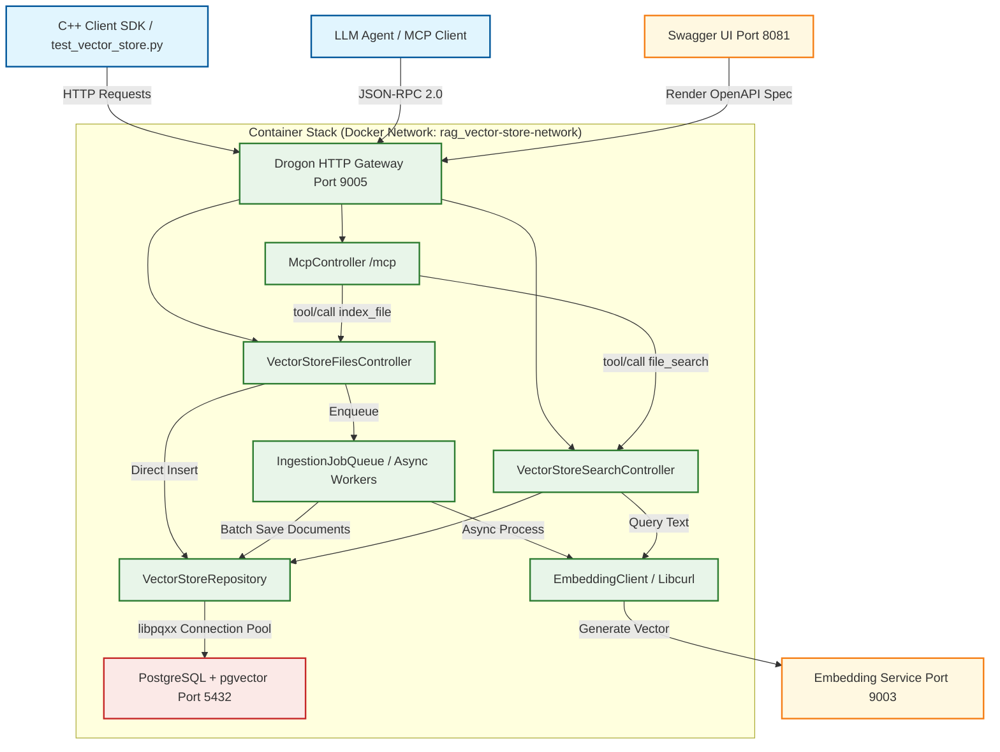

# C++ Vector Store Platform

An enterprise-grade, high-performance, standalone C++ vector database microservice built with the **Drogon HTTP Framework**, **libpqxx (PostgreSQL C++ client)**, and **pgvector**. It provides OpenAI-compatible vector store management, asynchronous document ingestion, pgvector HNSW-indexed similarity searches, and native **Model Context Protocol (MCP)** JSON-RPC integrations for LLM-agentic execution.

---

## 🏗️ System Architecture & Workflow Diagram

The microservice runs as a containerized multi-service stack. It maintains an internal, highly concurrent, thread-safe asynchronous queue for document ingestion and utilizes a robust libpqxx database connection pool for secure, transactional SQL executions.



---

## 📂 Project Structure & Directory Map

```text
.
├-- Dockerfile                  # Multi-stage Docker build: compiles C++ to arm64 runtime image
├-- docker-compose.yml          # Containerized full stack (PostgreSQL + C++ App + Swagger UI)
├-- deploy-to-device.sh         # ADB deployment script (cross-builds on PC -> runs on ARM64 device)
├-- openapi.json                # Complete OpenAPI 3.0 REST API specification
├-- mcp_servers.json            # Model Context Protocol server configuration
├-- run-client-python.sh        # Automation wrapper script for Python client execution
├-- client/ # Standalone Python Client SDK (OOP Style, identical to C++)
│   ├-- Dockerfile              # Lightweight Python container builder with build-time pytest gate
│   ├-- requirements.txt        # Python client dependency specification
│   ├-- vector_store_client_config.json # Fallback parameters matching C++
│   ├-- src/
│   │   ├-- __init__.py         # Namespace packaging exposure
│   │   ├-- client.py           # Unified client SDK library
│   │   └-- main.py             # Main pipeline orchestrator and profiler
│   └-- tests/
│       ├-- __init__.py
│       └-- test_client.py      # Automated pytest unit test coverage suite
└-- vector-store/               # Core C++ Platform Service Source
    ├-- CMakeLists.txt          # Drogon service build configuration
    ├-- include/                # SDK Header Declarations
    │   ├-- VectorStoreDTOs.h   # JSON-serializable request/response objects (using nlohmann/json)
    │   ├-- controllers/        # REST Route Controller Handlers (Health, Search, Files, MCP)
    │   ├-- db/                 # Libpqxx repository & PgConnectionPool
    │   ├-- embedding/          # Libcurl EmbeddingClient (HTTP + Circuit Breaker)
    │   ├-- jobs/               # Async worker thread pool and IngestionJobQueue
    │   └-- store/              # VectorStoreManager state controller singleton
    ├-- src/                    # C++ Implementations
    └-- migrations/             # Automatically run PostgreSQL SQL migrations on service startup
```

---

## 🎛️ REST API & Endpoints Reference

### Core Management
* **`GET /v1/health`**: Deep system health-check inspecting PgConnectionPool, pgvector extension, and Embedding Sidecar availability.
* **`POST /v1/vector_stores`**: Initializes a new vector collection schema in the database with custom HNSW configurations (`hnsw_m`, `hnsw_ef_construction`).
* **`GET /v1/vector_stores`**: Lists metadata, hyperparameter configurations, and status of all active collections.
* **`GET /v1/vector_stores/{id}`**: Retrieves metadata and detailed structural parameters for a single collection.
* **`PUT /v1/vector_stores/{id}`**: Updates collection display name and custom config metadata safely.
* **`DELETE /v1/vector_stores/{id}`**: Drops the collection schema, cascading hard deletes to associated chunks and vector indexes.

### Ingestion & Processing
* **`POST /v1/vector_stores/{id}/files`**: Enqueues text chunks for asynchronous vector generation, batch PostgreSQL indexing, and HNSW construction. (Returns `202 Accepted` with a `job_id`).
* **`GET /v1/vector_stores/{id}/files`**: Audit logs of all enqueued and processed ingestion jobs in the collection.
* **`GET /v1/vector_stores/{id}/files/{job_id}`**: Retrieves progress status, total/processed/failed counters, and active errors of an ingestion job.
* **`POST /v1/vector_stores/{id}/insert_with_vectors`**: Inserts text chunks and pre-computed embedding vectors directly to PostgreSQL, bypassing network sidecar latency.

### Retrieval & Search
* **`POST /v1/vector_stores/{id}/search`**: Semantic similarity search employing pgvector distance query (`<#>`) with support for GIN-indexed JSONB metadata containment filters.
* **`GET /v1/vector_stores/{id}/documents/{doc_id}`**: Fetches a single document's text, metadata, and its raw **768-dimension pgvector float array**.
* **`POST /mcp`**: Exposes the high-speed semantic search (`file_search`) and ingestion (`index_file`) capabilities to LLM agents using Model Context Protocol (MCP) standards.

---

## 🚀 How to Use (Step-by-Step)

### 📋 Prerequisites
* **Docker Engine** (v20.10+) with the Compose plugin.
* **C++ Compiler** (GCC 13+ or Clang 16+) and **CMake** (v3.22+) *(only for native host compilation)*.
* **Python 3.8+** with `pytest` and `requests` libraries *(only for running integration test suites)*.
* **ADB (Android Debug Bridge)** *(only for deploying to ARM64 target devices)*.

---

### 💻 Step 1: Run the Server Platform (Local PC)

To start the full platform stack locally (PostgreSQL + Drogon App + Swagger UI):

```bash
# Build the C++ microservice and launch the database, application, and swagger-ui
docker compose up --build -d

# Verify that all containers are healthy and running:
docker compose ps
```

The C++ Platform Gateway is now listening on **`http://localhost:9005`** and Swagger UI is fully interactive on **`http://localhost:8081`**.

---

### 🧠 Step 2: Compile & Run the Client SDK

The client SDK execution is completely automated and container-isolated using our localized execution wrapper script:

```bash
# Build and run the standalone client pipeline automatically (clones/syncs input documents into a clean /data folder):
./run-client-python.sh http://localhost:9005 "The food was delicious and the waiter"
```

---

### 📲 Step 3: Deploy to a Remote ARM64 Device via ADB

If you are deploying to a mobile, automotive, or graviton cloud target using ADB:

```bash
# Ensure your target device is accessible:
adb devices

# Compile linux/arm64 binaries on PC, transfer via ADB, start the stack, and forward ports:
chmod +x deploy-to-device.sh
./deploy-to-device.sh
```

---

### 📝 Practical Examples & End-to-End Walkthrough

#### 1. System Health Check
Verify your PgConnectionPool, pgvector extension, and Ollama connection are fully operational:
```bash
curl -s http://localhost:9005/v1/health | jq .
```

#### 2. Create an Isolated Collection Store
Initialize a collection with a custom nomic model and optimized HNSW index construction parameters:
```bash
curl -s -X POST http://localhost:9005/v1/vector_stores \
  -H "Content-Type: application/json" \
  -d '{
    "id": "vs_cpp_automated_test",
    "name": "Integrated Store",
    "embedding_model": "nomic-embed-text-v1",
    "embedding_dim": 768,
    "hnsw_m": 16,
    "hnsw_ef_construction": 64,
    "hnsw_ef_search": 40
  }' | jq .
```

#### 3. Fetch Raw Embedding Vectors
Retrieve the document's original metadata alongside its stored raw **768-float array** directly from the database:
```bash
# Retrieve full document representation
curl -s http://localhost:9005/v1/vector_stores/vs_cpp_automated_test/documents/1 | jq .

# Extract the raw embedding array and verify its dimensions (should be 768)
curl -s http://localhost:9005/v1/vector_stores/vs_cpp_automated_test/documents/1 | jq '.embedding | length'
```

#### 4. Semantic Similarity Search
Perform inner product similarity searches with containment matching filters against JSONB metadata fields:
```bash
curl -s -X POST http://localhost:9005/v1/vector_stores/vs_cpp_automated_test/search \
  -H "Content-Type: application/json" \
  -d '{
    "query": "The food was delicious",
    "top_k": 3,
    "score_threshold": 0.0,
    "filter": {"source": "vscode_cpp_client_direct"}
  }' | jq .
```

#### 5. Model Context Protocol Handshake (MCP)
List the vector search tools exposed to AI models:
```bash
curl -s -X POST http://localhost:9005/mcp \
  -H "Content-Type: application/json" \
  -d '{"jsonrpc":"2.0","method":"tools/list","id":1}' | jq .
```

---

## 🏛️ Static Drogon Build & MySQL/MariaDB Elimination

To ensure absolute licensing compliance and eliminate unnecessary runtime dependencies, our platform **fully compiles the Drogon Web Framework statically from source** inside our multi-stage `builder` container.
* By configuring Drogon with `-DBUILD_MYSQL=OFF`, we **completely avoid installing any MySQL/MariaDB client dynamic packages** on either the PC builder or target runtime.
* This guarantees that the final compiled `vector-store` binary is **100% free of MySQL/MariaDB linkages**, removing any LGPL or GPL licensing compliance risks from our system.
* It also builds as a **static library** (`-DBUILD_SHARED_LIBS=OFF`), meaning our final compiled executable is incredibly portable, standalone, and does not require `libdrogon` dynamic packages to run on the target device.

---

## 🐍 Standalone Python Client SDK (`client`)

The **Standalone Python Client SDK** (`client`) is an exact, OOP-style, commercially safe, and lightweight functional equivalent of the C++ Client SDK.

### 📂 Directory Layout
```text
client/
├-- Dockerfile                     # Multi-stage builder runner with CI/CD unit tests gate
├-- requirements.txt               # Unified project dependency management definition
├-- vector_store_client_config.json # Fallback JSON configuration parameters
└-- src/
    ├-- __init__.py                # Namespace packaging exposure
    ├-- client.py                  # Standalone VectorStoreClient wrapper library
    └-- main.py                    # Complete OOP-style RAG pipeline orchestrator
```

### ✨ Core Features & SDK Capabilities
* **Native In-Memory PDF Page Loading**: Employs `pypdf` to parse and extract text page-by-page natively inside the container.
* **Word-Boundary Aligned Sliding-Window Chunking**: Splits document text using the exact sliding window algorithm as the C++ SDK, matching its chunk outputs precisely.
* **Automated NPU/TPU Embedding Generation**: Interfaces with the local `genai_service_t2e` container (Port 9090) to generate float vectors sequentially on the device.
* **Direct pgvector Insertion & Batching**: Direct, high-speed ingestion of document segments and float vectors in optimal batches of 100 to prevent API timeouts.
* **Performance timing & Port transfer Profiling**: Automatically tracks and prints timing metrics, loops delays, and system database memory footprints in real-time.
* **Build-Time Pytest Unit Testing Gate**: Every Docker build executes a complete `pytest` unit test suite as a hard gate. If any tests fail, the build is aborted immediately.

---

## 🚀 How to Run the Python Client SDK

You can run the Python-based client pipeline natively on the host network, connecting directly to the running server.

```bash
# Ingest and query a PDF file (e.g. 'llama2.pdf') against the server on any target device (e.g. 1143202436):
./run-client-python.sh http://localhost:9005 /data/llama2.pdf

# Execute a direct semantic search query (skipping database ingestion pipeline):
./run-client-python.sh http://localhost:9005 "What is Llama 2?"
```

---

## 🔒 Security & Container Hardening

The C++ Platform follows strict cloud-native security paradigms:
* **Unprivileged Non-root Execution**: The Drogon API server processes run purely as `www-data:www-data` (UID/GID `33`) inside the container.
* **Privilege Escalation Suppression**: Configured with `no-new-privileges:true` in docker-compose.yml to block SUID/SGID exploit path vector executions.
* **Explicit Capability Dropping**: Drops all default Linux kernel capabilities (`cap_drop: ALL`) and re-adds only `NET_BIND_SERVICE`.
* **Database Isolation**: Connections are pooled within a dedicated bridge network (`rag_vector-store-network`) with pgdata mapped on local volumes.
